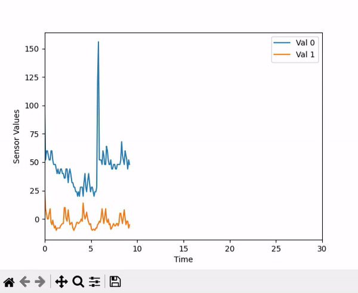

# `daq_connectivity`
This repository is used for easily acquire serial data via USB for DATAQ Instruments products. Two methods are supported: ascii and binary.

The code is based on [this repo](https://github.com/dataq-instruments/Simple-Python-Examples). It essentially converts an analog input (voltage) to a digital value. 

The data can be printed in a terminal or it can be represented in real time in an animated plot using `matplotlib`. 

## Examples of use:

| Serial monitor |  Serial plotter |
|----------|--------------|
|  |  | 
